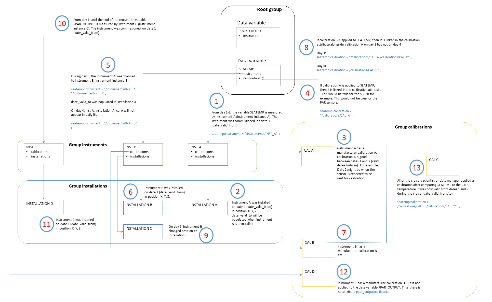

# netcdf-specification-v1.0
I/Ocean NetCDF convention for delayed mode underway data from research vessels

## I/Ocean NetCDF principle
The NetCDF consists of a root group that contains the routine underway data and information relevant to them. The file is supplimented by deployments, instruments, calibrations and installations (instrument locations) NetCDF groups. Each group contains sub-groups that represent an instance. For example, an instance of an instrument or calibration that is relevant to the data. Each each is governed by valid dates. The image below summaries the principle of instances to the data.

Click on the image to enlarge.

